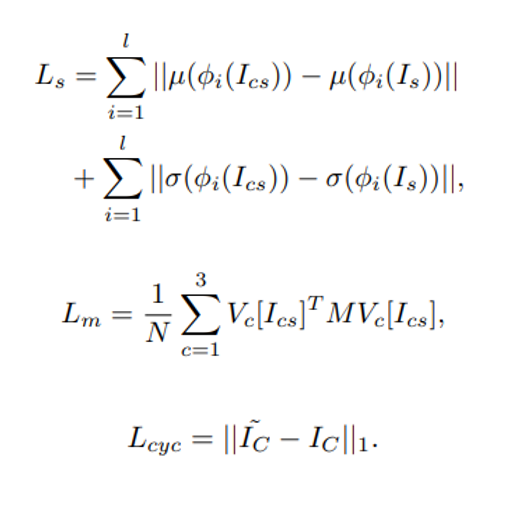

<center>
    <h1>
        Jittor 草图生成风景比赛 </br>GauGAN + CAP-VSTNet
    </h1>
    <i>JittorAnything</i>
</center>


## 队伍成员及分工

* 李想：负责 $CAP-VSTNet$ `FPSE`的实现与仓库维护
* 王圣远：负责算法 `GauGAN`的实现与报告撰写
* 汪晗阳：

## 实现效果

截止到2023年6月25日，我们采用的算法在 $A$ 榜排名第 $7$，得分 $0.5852$，提交 $request\_id$ 为 $2023062410301698977686$。

我们在训练集上利用 $CAP-VSTNet$ 实现的风格迁移效果如下（第一行为原图像，第二行为参考风格图像，第三行为输出图像）：

<center>

</center>

我们在测试集上实现的效果如下（左上为语义标签图，右上为参考风格图，左下为 $GauGAN$ 生成的图像，右下为在 $GauGAN$ 基础上利用 $CAP-VSTNet$ 进行风格迁移后生成的图像）：

<center>

</center>


## 算法背景

我们主要在比赛提供的 baseline $GauGAN$（[Semantic Image Synthesis with Spatially-Adaptive Normalization](https://arxiv.org/abs/1903.07291)）的基础上，使用 `Jittor` 框架尝试复现了 $CAP-VSTNet$（[CAP-VSTNet: Content Affinity Preserved Versatile Style Transfer ](https://arxiv.org/abs/2303.17867)）的模型结构，对 baseline 的训练结果进行进一步的风格迁移，分阶段成功跑通训练和测试流程，基本复现了原论文的结果，并通过对网络参数的调整，实现了在比赛数据集上达到更好的效果。

### $GauGAN$


对于 $GauGAN$ 网络架构的介绍，可以参考仓库 [wenqi-wang20/jittor-ThisNameIsGeneratedByJittor-Landscape: 第二届计图人工智能挑战赛，基于Jittor的草图风景图像生成大赛 (github.com)](https://github.com/wenqi-wang20/jittor-ThisNameIsGeneratedByJittor-Landscape)

### $CAP-VSTNet$

$CAP-VSTNet$ 的主要创新点在于抛弃了传统图像风格迁移工作中所使用的 $encoder-transformation-decoder$ 架构，而是使用了一个新的**可逆残差网络**和一个基于 Cholesky 分解的**无偏线性变换模块**，降低了风格迁移过程中特征与像素的亲和力损失（affinity loss），保证了内容细节的清晰以及相同语义区域内风格特征的一致性，从而有效降低了风格迁移中常见的伪影问题。新的可逆残差网络不仅可以保留内容的亲和力，而且不会像传统的可逆网络那样引入冗余信息，从而实现更加有效的风格迁移；同时，通过使用 Matting Laplacian 训练损失，网络弥补了传统的线性变换所导致的像素亲和力损失问题。详细架构如下图所示：

<center>

</center>

工作流程如下：

* 给定一个内容图像（即content）和一个风格图像（即style），$CAP-VSTNet$ 首先通过 $Injective \ Padding \ (IP)$ 模块，将输入维度沿通道维度进行零填充；
* 之后通过网络的前向推理，将输入的内容/风格图像映射到隐空间（latent space），前向推理通过级联的 $Reversible \ Residual \ Block \ (RBB)$ 和 $Spatial \  Squeeze$ 模块实现；
* 这之后，一个 $Channel \ Refinement \ (CR)$ 模块被用来去除内容/风格图像特征中的通道冗余信息，以实现更有效的风格转换；
* 再然后，一个线性变换模块 $cWCT$ 被用来迁移内容表示，以匹配风格表示的统计数据；
* 最后，通过反向推理，将风格化的表示反过来映射到风格化的图像上，得到生成结果。

网络各部分的详细描述如下：

#### 可逆残差网络（$Reversible \ Residual \ Block$）+ 压缩模块（$Spatial \  Squeeze \ module$）

在 $CAP-VSTNet$ 中，输入会沿通道维度被划分为相同大小的输入对 $x_1,x_2$，之后通过可逆残差网络进行处理。

残差网络的前向推理过程如下（如上图中 a 部分所示）：
$$
x_1,x_2=split(x)\\
y_1=x_1+F(x_2),\ y_2=x_2
$$
后向推理过程如下（如上图中 b 部分所示）：
$$
y_1,y_2=split(y)\\
x_2=y_2,\ x_1=y_1-F(x_2)
$$
其中，残差函数 $F$ 由核大小为 $3$ 的连续卷积层实现，网络通过堆叠多层模块来增大感受野，以便捕捉密集的成对关系。

此外，为捕获大规模的风格信息，$CAP-VSTNet$ 使用了 $Spatial \  Squeeze$ 模块来归约空间信息，同时增大通道维度。

#### 通道细化模块（$Channel \ Refinement \ module$）

上述结构的问题在于，级联的可逆残差网络和压缩模块设计，导致了前向推理过程中冗余信息的积累，因为压缩模块会以指数形式增加通道，而冗余信息将对风格迁移产生负面影响。

于是，$CAP-VSTNet$ 使用了通道细化模块进行通道压缩，消除冗余信息，以实现更有效的风格转换。详细架构如下图所示：

<center>

</center>

在下图中可以看到，相较于使用全连接层（MLP）等其他设计方式，采用这样的架构可以最有效地减少伪影问题的出现：

<center>

</center>

#### 迁移模块

传统的网络架构采用基于**奇异值分解**的 $WCT$ 架构进行风格迁移，但当内容/风格表示的特征图具有相近的奇异值时，该架构便会失效，导致模型训练崩溃。

为此，$CAP-VSTNet$ 使用了**Cholesky 分解**来解决这一问题，将 $WCT$ 架构改进为 $Cholesky \ decomposition \ based \ WCT$，即 $cWCT$ 架构。

#### 损失函数

总体的损失函数可被定义为：
$$
L_{total} = L_s + \lambda_mL_m+\lambda_{cyc}L_{cyc}
$$
右侧分别代表风格损失函数、 Matting Laplacian 损失函数以及循环一致性损失函数，其定义如下：

<center>

</center>

由于 baseline $GauGAN$ 生成的图像在风格相似度这一指标上与参考风格图仍然有一定差距，我们将该生成图像作为 content，原先的参考风格图保留继续作为 style，两者共同作为输入传入 $CAP-VSTNet$ 中，最终生成的图像理论上在图像风格方面会更接近参考图，也即超越 baseline，得到更高的评测分数。

综上所述，我们的算法可以划分为如下**两个阶段**：

* 首先，$GauGAN$ 会使用输入的语义标签图（即 mask 图）与参考风格图（即 ref 图）输出生成图像（即 gen 图）；

* 之后，$CAP-VSTNet$ 会使用参考风格图与上一阶段得到的生成图像，进行进一步的风格迁移，输出最终的生成图像。

与 baseline 相比，我们的算法在 **FID** 及 **风格相似度** 两个评测指标上的表现均有明显提升：

<center>

</center>

此处模型的一些超参数为：

* $GauGAN$：190 epoch（模型训练 $190$ 轮次）
* $CAP-VSTNet$：600 epoch + finetune（模型训练 $190$ 轮次 + 进行 finetune）


## 安装

本项目主要运行在单张卡的 3090 上，200个 epoch 的训练周期一般为 4~5 天。

#### 运行环境

- ubuntu 20.04 LTS
- python >= 3.7
- jittor >= 1.3.0

#### 安装依赖

可以进入相应目录执行以下命令安装依赖（ jittor 框架请遵循官网给出的安装指导）

在`gaugan`目录下执行
```
pip install -r requirements.txt
```

#### 数据预处理

数据目录我们没有上传，请遵循赛事公告进行[下载](https://cloud.tsinghua.edu.cn/f/1d734cbb68b545d6bdf2/?dl=1)。在本次比赛中，我们没有采取更多的数据预处理操作，裁剪、正则化等操作在项目代码中已经有所体现。

预训练模型我们采用的是 `Jittor` 框架自带的 `vgg19` 模型，无需额外下载，在代码运行的过程中会载入到内存里。

下载后将label与img的映射关系（*label_to_img.json*）放置在`gaugan`目录下，测试集保存至`gaugan/data/val_A_labels_resized`

风格迁移前的图片保存在`CAP-VSTNet/data/content`，参考风格图片保存在`CAP-VSTNet/data/style`，

## 训练

在单卡上训练，只需执行以下命令（针对 $SPADE$ 和 $FPSE$ 均可）：

```bash
python train.py  \
--name "your project name" \ 
--datasetmode custom \
--label_dir "your train labels directory" \
--image_dir "your train images directory" \
--label_nc 29 \ 
--batchSize "your batchsize" \
--no_instance \
--use_vae
```

因为受平台算力的限制 （单卡3090），$FPSE$ 算法需要更高的参数量，也就需要更大的GPU内存。在实际操作中，$FPSE$ 只能使用 `batchsize = 1` 的梯度下降，导致模型训练效果较佳，但是泛化性能很差；相比之下，$SPADE$ 需要的模型参数量更小，可以使用 `batchsize = 4` 的梯度下降，相应地在测试集上的效果也就更好。我们最终是选择了$SPADE$ 算法的结果上交比赛平台。

## 推断

在单卡上进行测试，只需执行以下命令（针对 $SPADE$ 和 $FPSE$ 均可）：

```bash
python test.py  \
--name "your project name (the same as the train project)" \ 
--datasetmode custom \
--label_dir "your test labels directory" \
--label_nc 29 \ 
--no_instance \
--use_vae
```

## 致谢

我们将原论文的 `pytorch` 版本的源代码，迁移到了 `Jittor` 框架当中。其中重度参考了论文的官方开源代码：[CAP-VSTNet](https://github.com/linfengWen98/CAP-VSTNet)。
